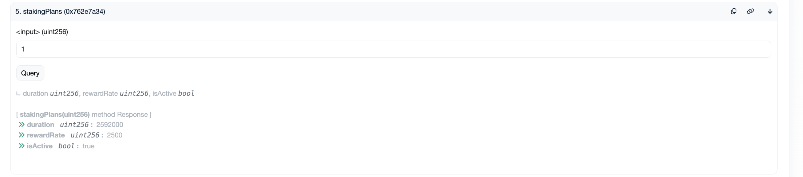

# 📊 KaiToken On-chain Demo

This contract is deployed and live on Sepolia testnet. The demo showcases a complete token ecosystem including token creation, presale functionality, and staking mechanisms.

---

## ✅ Kai Token

- [View KaiToken on Sepolia Etherscan](https://sepolia.etherscan.io/address/0x7D98DF6357b07A3c0deDF849fD829f7296b818F5)

## ✅ Token Presale

- [View Presale Contract on Sepolia Etherscan](https://sepolia.etherscan.io/address/0x641A10285b1110001D6475D19395Adcfa64E5260)

### How to Purchase Tokens

1. **Connect MetaMask & Enter Amount**
   - Connect your MetaMask wallet
   - Input 0.1 ETH in the buy function
   
   

2. **Confirm Transaction**
   - Approve the transaction in MetaMask
   
   

     
   

3. **Add Token to MetaMask**
   - In MetaMask, click "Import Tokens"
   - Enter token address: `0x641A10285b1110001D6475D19395Adcfa64E5260`
   - Your purchased tokens will appear in your wallet

---

## 🪙 Staking

- [View Staking Contract on Sepolia Etherscan](https://sepolia.etherscan.io/address/0x3cfECcF7379fdb424BB42D258fa10e63F1b0CC59)

### Staking Features

#### Check Your Reward Balance
Monitor your accumulated rewards before claiming or unstaking:

#### Available Staking Plans
Three staking plans are available:
- Flexible (ID: 0) - No lock period
- 30-day lock (ID: 1)
- 180-day lock (ID: 2)

View all plans using the `totalPlans` method:

#### How to Stake Tokens
1. Select your desired plan ID (0, 1, or 2)
2. Enter amount (in wei): `amount * 10^18`
3. Confirm transaction

---

## 🔗 Contract Addresses

| Contract    | Address |
|-------------|---------|
| KaiToken    | `0x7D98DF6357b07A3c0deDF849fD829f7296b818F5` |
| Presale     | `0x641A10285b1110001D6475D19395Adcfa64E5260` |
| Staking     | `0x3cfECcF7379fdb424BB42D258fa10e63F1b0CC59` |

---

## 📚 Technical Implementation

This demo showcases a complete token ecosystem with:
- ERC-20 token implementation
- Secure presale mechanism with rate controls
- Multi-tiered staking system with time-based rewards
- Complete on-chain verification and transparency
